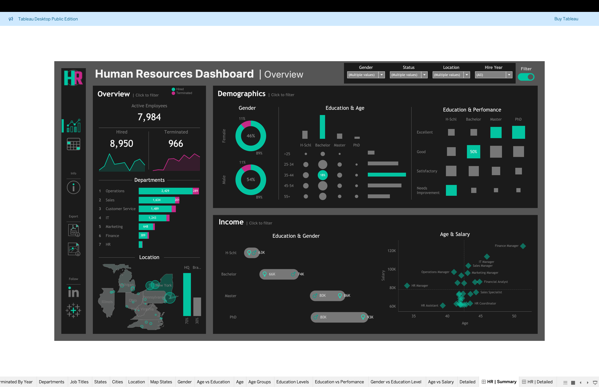

# 📊 HR Analytics Dashboard (Tableau)

An interactive HR Analytics Dashboard built using Tableau to analyze employee data, salary trends, and performance insights using a synthetic dataset.

---

## 🔍 Project Overview

This project visualizes key Human Resources metrics to support data-driven decision-making.  
The dataset used in this project is synthetic and created for learning and portfolio purposes.

---

## 🛠️ Tools Used

- Tableau Desktop / Tableau Public  
- Synthetic HR Dataset (CSV/Excel)  
- Data Visualization & Analysis  

---

## 📸 Dashboard Preview

### Main Dashboard

  
  

---

## 🌐 Live Dashboard

🔗 Tableau Public:  
https://public.tableau.com/app/profile/harsh.patel6897/viz/HRDashboard_17698838664750/HRSummary

---

## 🚀 Key Features

- Interactive filters  
- Salary & performance analysis  
- Employee insights  
- Clean dashboard design  

---

## 👤 Author

**Harsh Patel**  
Aspiring Data Analyst / Data Scientist  

---

⭐ Feel free to share feedback!
